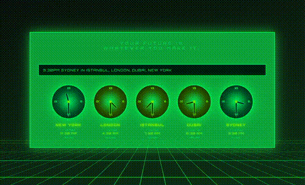

# 🕐 TiME 🌍

TiME is a radical retro-styled time zone converter that transforms boring time calculations into a visual synthwave experience. Convert times across multiple cities with analog clocks that adapt their glow based on AM/PM - all wrapped in that sweet 80s aesthetic.

<div align="center">
  
</div>

## 0 dependencies, 0 build tools, Pure JS!

This is an almost[^1] pure client-side JS code. No Node.js, no npm, no bundlers - just upload and go! 

[^1]: There's a single PHP file (optional) for verifying hardcoded time zones from WorldTimeAPI.org to adjust for daylight saving time.


## ✨ Features

- 🎯 **Natural Language Input** - "3:30pm new york in tokyo, paris"
- 🕐 **Analog Clock Visualization** - Beautiful SVG clocks with AM/PM color coding
- 🌍 **1200+ Cities Supported** - Comprehensive global coverage
- 🏙️ **City Disambiguation** - "san jose (usa)" vs "san jose (costa rica)"
- ✅ **Real-Time Verification** - WorldTimeAPI integration
- 🎨 **Retro 80s Aesthetic** - Neon green glow, scanlines, synthwave vibes
- 📱 **Fully Responsive** - Mobile, tablet, desktop
- 🚀 **Zero Dependencies** - Pure ES6 modules, no frameworks

## 📁 Project Structure

```
time-js/
├── index.html                    # Main HTML with inline CSS
├── manifest.json                 # PWA manifest
├── js/
│   ├── main.js                   # Entry point, module initialization
│   ├── TimeParser.js             # Natural language parsing logic
│   ├── TimeVerificationService.js # WorldTimeAPI integration
│   ├── data/
│   │   └── cityTimezoneMap.js    # 1200+ city-timezone mappings
│   └── modules/
│       ├── quotes.js             # Rotating header quotes
│       ├── clock_renderer.js     # SVG analog clock rendering
│       ├── animations.js         # Clock animations
│       ├── SearchModule.js       # Search & time conversion
│       └── VerificationModule.js # Time verification UI
├── api/
│   └── worldtime.php             # Optional PHP proxy for WorldTimeAPI
├── icon*.png                     # PWA icons (16, 32, 192, 512)
├── icon.svg                      # SVG icon
├── favicon-*.png                 # Favicon files
├── apple-touch-icon.png          # Apple touch icon
├── app_v1.gif                    # Demo screenshot
├── .gitignore                    # Git ignore file
└── README.md                     # This file
```

## 🚀 Quick Start

### Option 1: Python HTTP Server

```bash
python3 -m http.server 3001
# Open http://localhost:3001
```

### Option 2: PHP Built-in Server

```bash
php -S localhost:3001
# Open http://localhost:3001
```

### Option 3: Node.js (if you have it)

```bash
npx serve -p 3001
# Open http://localhost:3001
```

### Option 4: Any Static File Server

Just serve the `time-js` folder from any web server!

## 🌐 Deployment

Upload files via FTP/SFTP to any web host. Works on Apache, Nginx, any server.

## 💻 How It Works

### Pure ES6 Modules

The app uses native browser ES6 modules (`type="module"`). No transpilation needed!

```javascript
import { TimeParser } from './TimeParser.js';
import { QuotesModule } from './modules/quotes.js';
```

### Native Browser APIs

- **Intl.DateTimeFormat** - Timezone conversions
- **Fetch API** - WorldTimeAPI calls
- **LocalStorage** - Verification caching
- **History API** - URL management
- **Native Date** - All time operations

### No Build Step Required

Just edit files and refresh! The browser handles:
- ES6 module loading
- Timezone calculations
- CORS (WorldTimeAPI supports it)
- Caching

## 📚 Architecture

### TimeParser.js

Parses natural language queries:
- Regex-based parsing
- Timezone abbreviation expansion
- City disambiguation
- Native Intl API for conversions

### TimeVerificationService.js

Verifies times against WorldTimeAPI:
- Retry logic with exponential backoff
- Rate limiting (30 req/min)
- Error handling
- Connection resilience

### Modules

- **QuotesModule** - Rotating Doc Brown quotes
- **ClockRenderer** - SVG clock generation
- **AnimationsModule** - Clock hand animations, slide in/out
- **SearchModule** - Form handling, URL encoding
- **VerificationModule** - Verification UI, caching

## 🎨 Styling

All CSS is inline in `index.html`:
- Orbitron font (Google Fonts)
- Neon green color palette
- Scanline overlay effects
- Grid floor with perspective
- Smooth animations
- Responsive breakpoints

## 🔧 Browser Compatibility

Requires modern browsers with:
- ES6 modules support
- Fetch API
- Intl.DateTimeFormat with timezone support
- LocalStorage
- CSS animations

**Supported:**
- Chrome 61+
- Firefox 60+
- Safari 11+
- Edge 79+

**Not supported:**
- Internet Explorer (by design)

## 📝 Usage Examples

```
"3:30pm new york in tokyo, paris"
"noon PST in EST and GMT"
"9am london in sydney and singapore"
"midnight utc in jst, ist and cet"
"10am san jose (usa) in london"
```

### URL Scheme

Custom encoding for clean, shareable URLs:

```
"3:30pm new york in tokyo, paris"
→ /?query=3_30pm-new-york--tokyo~paris

Rules:
: → _    (colons to underscores)
in → --  (in to double hyphen)
, → ~    (comma to tilde)
space → - (space to single hyphen)
```

## 🌍 Supported Locations

1200+ cities across:
- **Oceania & Pacific** - 20+ cities
- **East Asia** - 25+ cities
- **Southeast Asia** - 15+ cities
- **South Asia** - 20+ cities
- **Middle East** - 25+ cities
- **Africa** - 30+ cities
- **Europe** - 200+ cities
- **North America** - 500+ cities
- **Central & South America** - 100+ cities
- **Caribbean** - 30+ cities

Plus timezone abbreviations: PST, EST, GMT, JST, IST, CET, AEST, etc.

## 🔒 Security & Privacy

- **No server-side code** - Everything runs in browser
- **No data collection** - Zero tracking or analytics
- **LocalStorage only** - Caching stays on your device
- **HTTPS ready** - Works on secure connections
- **CORS friendly** - WorldTimeAPI supports CORS

## 📄 License

MIT License

## 🙏 Acknowledgments

- WorldTimeAPI for verification
- Orbitron font by Google Fonts
- Inspired by 1980s synthwave aesthetic

---

<div align="center">

**Built with ♡ and Pure JavaScript**

**No dependencies. No build tools. Just works.**

</div>
