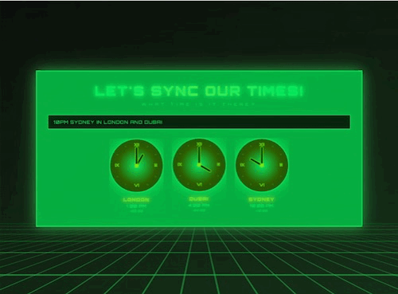

# 🕐 TiME 🌍

## Synch your watches!

TiME is a radical retro-styled time zone converter that transforms boring time calculations into a visual synthwave experience. Convert times across multiple cities with analog clocks that adapt their glow based on AM/PM - all wrapped in that sweet 80s aesthetic.

<div align="center">
  
</div>

## ✨ Features

- 🎯 **Natural Language Input** - Just type like you speak: "3:30pm new york in tokyo, paris"
- 🕐 **Analog Clock Visualization** - Beautiful SVG clocks with AM/PM color coding
- 🌍 **1200+ Cities Supported** - Unprecedented global coverage with automatic timezone detection
- 🏙️ **City Disambiguation** - Specify country for same-named cities: "san jose (usa)" vs "san jose (costa rica)"
- 📱 **Fully Responsive** - Looks rad on mobile, tablet, and desktop
- 🎨 **Retro 80s Aesthetic** - Neon green glow, scanlines, and synthwave vibes
- ⚡ **Zero External Dependencies** - Pure Rails, no JavaScript frameworks needed
- 🚀 **Instant Conversion** - Just press Enter, no buttons needed

## 🛠️ Tech Stack

```
╔════════════════════════════════════════╗
║   BUILT WITH PURE RAILS POWER          ║
╠════════════════════════════════════════╣
║ • Ruby on Rails 8.0                    ║
║ • Pure CSS (No frameworks!)            ║
║ • Vanilla JavaScript                   ║
║ • SVG Analog Clocks                    ║
║ • ActiveSupport TimeZone               ║
╚════════════════════════════════════════╝
```

[](https://www.ruby-lang.org/)
[](https://rubyonrails.org/)
[](LICENSE)

## 🚀 Quick Start

### Prerequisites

- Ruby 3.4.5 or higher
- Rails 8.0 or higher
- Bundler

### Installation

```bash
# Clone the repository
git clone https://github.com/boraoku/time.git
cd time

# Install dependencies
bundle install

# Create and migrate database
rails db:create
rails db:migrate

# Start the server
rails server
```

Visit `http://localhost:3000` and start syncing times!

## 💚 Usage Examples

```
Input Examples:
═══════════════════════════════════════════════════
→ "10pm sydney in london and dubai"
→ "3:30pm new york in tokyo, paris"  
→ "noon PST in EST and GMT"
→ "midnight london in sydney, LA, moscow"
→ "9:45 PM EST in London, Dubai, Singapore, Tokyo"

City Disambiguation (for same-named cities):
═══════════════════════════════════════════════════
→ "10am san jose (usa) in london"
→ "10am san jose (costa rica) in london"
→ "3pm birmingham (uk) in birmingham (usa)"
→ "2pm naples (italy) in naples (usa)"
→ "5pm st petersburg (russia) in tokyo"
═══════════════════════════════════════════════════
```

## 🎨 Design Philosophy

This app embraces the radical aesthetic of the 1980s:

- **Neon Green Color Palette** - Because the future was green in the 80s
- **Analog Clocks** - Digital is cool, but analog is forever
- **Scanline Effects** - That authentic CRT monitor feel
- **Grid Floor Pattern** - Straight from TRON
- **Orbitron Font** - Futuristic yet nostalgic

## 🗺️ Supported Locations

<details>
<summary>Click to see all 1200+ supported cities worldwide</summary>

### 🌏 Oceania & Pacific
**Australia**: Sydney, Melbourne, Brisbane, Perth, Adelaide, Hobart, Darwin, Canberra  
**New Zealand**: Auckland, Wellington, Christchurch  
**Pacific Islands**: Fiji, Honolulu, Guam, Samoa, Tahiti, Port Moresby, Honiara, Noumea

### 🌏 East Asia
**Japan**: Tokyo, Osaka, Kyoto, Nagoya, Sapporo, Yokohama  
**China**: Beijing, Shanghai, Guangzhou, Shenzhen, Chengdu, Wuhan, Tianjin, Hong Kong, Macau  
**Korea**: Seoul, Busan  
**Taiwan**: Taipei  
**Philippines**: Manila, Cebu  
**Mongolia**: Ulaanbaatar  
**Russia (Far East)**: Vladivostok

### 🌏 Southeast Asia
**Singapore**, **Malaysia**: Kuala Lumpur  
**Indonesia**: Jakarta, Bali  
**Thailand**: Bangkok, Phuket  
**Vietnam**: Hanoi, Ho Chi Minh City (Saigon)  
**Cambodia**: Phnom Penh | **Laos**: Vientiane  
**Myanmar**: Yangon | **Brunei**: Bandar Seri Begawan

### 🌏 South Asia
**India**: Delhi, Mumbai, Bangalore, Kolkata, Chennai, Hyderabad, Pune, Ahmedabad  
**Pakistan**: Karachi, Lahore, Islamabad  
**Bangladesh**: Dhaka | **Sri Lanka**: Colombo  
**Nepal**: Kathmandu | **Maldives**: Male | **Afghanistan**: Kabul

### 🌍 Middle East
**UAE**: Dubai, Abu Dhabi | **Qatar**: Doha | **Kuwait**: Kuwait City  
**Saudi Arabia**: Riyadh, Jeddah, Mecca, Medina  
**Oman**: Muscat | **Bahrain**: Manama  
**Lebanon**: Beirut | **Syria**: Damascus | **Jordan**: Amman  
**Israel**: Jerusalem, Tel Aviv | **Iraq**: Baghdad  
**Iran**: Tehran | **Turkey**: Istanbul, Ankara  
**Armenia**: Yerevan | **Azerbaijan**: Baku | **Georgia**: Tbilisi  
**Cyprus**: Nicosia

### 🌍 Africa
**North Africa**: Cairo, Alexandria, Algiers, Tunis, Casablanca, Rabat, Marrakech, Tripoli  
**West Africa**: Lagos, Abuja, Accra, Dakar, Abidjan  
**East Africa**: Nairobi, Addis Ababa, Dar es Salaam, Kampala, Khartoum  
**Central Africa**: Kinshasa  
**Southern Africa**: Johannesburg, Cape Town, Durban, Pretoria, Harare, Lusaka, Windhoek, Gaborone, Maputo  
**Islands**: Antananarivo, Port Louis

### 🌍 Europe
**UK & Ireland**: London, Manchester, Birmingham, Glasgow, Edinburgh, Belfast, Cardiff, Dublin, Cork  
**France**: Paris, Lyon, Marseille, Nice, Bordeaux  
**Germany**: Berlin, Munich, Frankfurt, Hamburg, Cologne, Stuttgart, Dusseldorf  
**Spain**: Madrid, Barcelona, Valencia, Seville, Malaga, Bilbao  
**Portugal**: Lisbon, Porto  
**Italy**: Rome, Milan, Naples, Turin, Venice, Florence  
**Netherlands**: Amsterdam, Rotterdam, The Hague  
**Belgium**: Brussels, Antwerp | **Luxembourg**  
**Switzerland**: Zurich, Geneva, Bern, Basel  
**Austria**: Vienna  
**Nordics**: Copenhagen, Stockholm, Oslo, Helsinki, Reykjavik  
**Eastern Europe**: Warsaw, Krakow, Prague, Budapest, Bucharest  
**Balkans**: Athens, Sofia, Belgrade, Zagreb, Ljubljana, Sarajevo, Skopje, Tirana  
**Baltics**: Tallinn, Riga, Vilnius  
**Russia & Belarus**: Moscow, St Petersburg, Novosibirsk, Yekaterinburg, Minsk  
**Ukraine**: Kyiv  
**Microstates**: Monaco, Vatican City, San Marino, Andorra, Liechtenstein (Vaduz), Malta (Valletta)

### 🌎 North America
**USA East Coast**: New York, Boston, Philadelphia, Washington DC, Baltimore, Miami, Orlando, Atlanta, Charlotte, Detroit, Cleveland, Pittsburgh, Buffalo  
**USA Central**: Chicago, Houston, Dallas, San Antonio, Austin, Memphis, Nashville, New Orleans, Milwaukee, Minneapolis, St Louis, Kansas City  
**USA Mountain**: Denver, Salt Lake City, Albuquerque, Phoenix, Tucson  
**USA West Coast**: Los Angeles, San Francisco, San Diego, San Jose, Seattle, Portland, Sacramento, Oakland, Las Vegas  
**Alaska**: Anchorage, Fairbanks, Juneau  
**Hawaii**: Honolulu  
**Canada**: Toronto, Montreal, Ottawa, Quebec City, Vancouver, Calgary, Edmonton, Winnipeg, Halifax, St. John's, Regina, Saskatoon, Whitehorse, Yellowknife, Iqaluit

### 🌎 Central America & Caribbean
**Mexico**: Mexico City, Guadalajara, Monterrey, Cancun, Tijuana  
**Central America**: Guatemala City, San Salvador, Tegucigalpa, Managua, San Jose, Panama City, Belize City  
**Caribbean**: Havana, Santo Domingo, San Juan, Kingston, Nassau, Port-au-Prince, Bridgetown, Port of Spain  
**Caribbean Islands**: Castries, Basseterre, Roseau, St. George's, Oranjestad, Willemstad, and more

### 🌎 South America
**Colombia**: Bogota, Medellin, Cali | **Venezuela**: Caracas  
**Ecuador**: Quito, Guayaquil | **Peru**: Lima  
**Bolivia**: La Paz, Sucre | **Chile**: Santiago, Valparaiso  
**Argentina**: Buenos Aires, Cordoba, Rosario, Mendoza  
**Uruguay**: Montevideo | **Paraguay**: Asuncion  
**Brazil**: São Paulo, Rio de Janeiro, Brasilia, Salvador, Fortaleza, Belo Horizonte, Manaus, Porto Alegre, Recife, Curitiba  
**Guianas**: Georgetown, Paramaribo, Cayenne  
**Falklands**: Stanley

</details>

## 🚀 Production Deployment

When deploying to production, you need to set the `SECRET_KEY_BASE` environment variable.

1. Generate a secret key locally:
```bash
bin/rails secret
```

2. Set the generated key as an environment variable on your production server:
```bash
# Example for Heroku
heroku config:set SECRET_KEY_BASE=<your_generated_secret>

# For other platforms, add SECRET_KEY_BASE to your environment variables
```

This secret key is used by Rails to encrypt session cookies and other sensitive data.

## 🤝 Contributing

Pull requests are welcome! For major changes, please open an issue first to discuss what you would like to change.

1. Fork the Project
2. Create your Feature Branch (`git checkout -b feature/AmazingFeature`)
3. Commit your Changes (`git commit -m 'Add some AmazingFeature'`)
4. Push to the Branch (`git push origin feature/AmazingFeature`)
5. Open a Pull Request

## 📝 License

This project is licensed under the MIT License - see the [LICENSE](LICENSE) file for details.

## 🙏 Acknowledgments

- Inspired by the radical aesthetic of the 1980s
- Built with love for the retro-future we were promised
- Special thanks to all timezone API maintainers

---

<div align="center">

```
╔═══════════════════════════════════════╗
║         Made with ♡ and Rails         ║
║          Synch your watches!          ║
╚═══════════════════════════════════════╝
```

**[⬆ back to top](#-lets-sync-our-times-)**

</div>